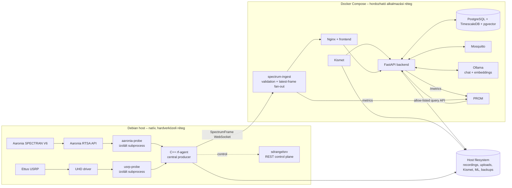
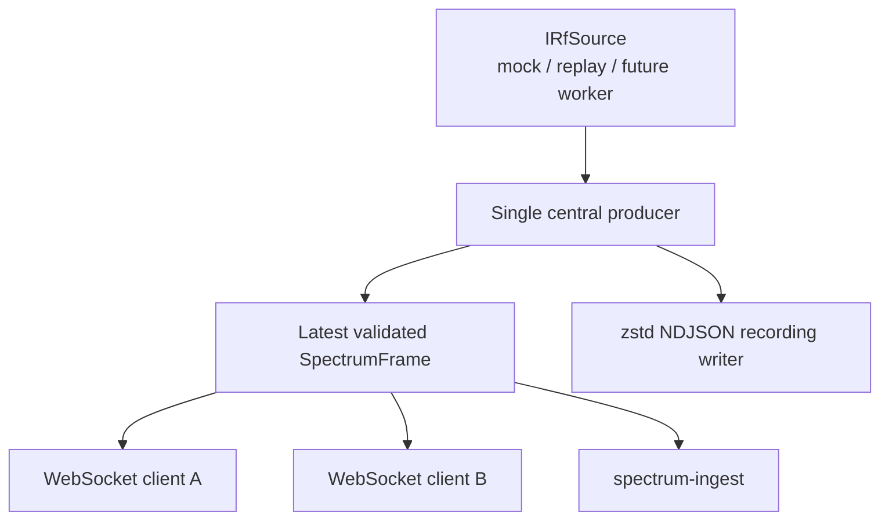
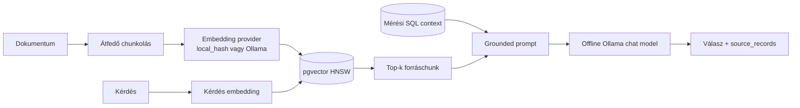

# Architektúra

Renderelt diagram: [SVG](docs/architecture.svg) · [PNG](docs/architecture.png)

## Áttekintő diagram

## RF adatút

A központi producer miatt:

- recording kliens nélkül is készül;
- több WebSocket-kliens nem fogyasztja el egymás elől a frame-eket;
- lassú kliens nem hoz létre korlátlan sort;
- minden downstream ugyanazt a sequence-folyamot látja, de lassú kliens
  kihagyhat köztes frame-eket.

## RAG és offline Ollama

A RAG **nem maga az AI-modell**. A RAG releváns dokumentumrészeket keres ki;
a generáló Ollama-modell ezek és a mérési SQL-kontextus alapján fogalmaz választ.
Az embeddingmodell és a chatmodell egymástól függetlenül cserélhető.

## Felelősségi határok

| Réteg | Felelősség | Nem tartozik ide |
|---|---|---|
| `rf-agent` | source lifecycle, SpectrumFrame, recording, hardverprobe, SDRangel vezérlés | PostgreSQL üzleti adatok |
| `spectrum-ingest` | upstream reconnect, schema-validáció, bounded fan-out, metrikák | hardverdriver |
| backend | DB, API, session, Kismet/BLE, ML, assistant/RAG, monitoring proxy | nagy sebességű IQ streaming |
| PostgreSQL | metadata, ritkított mérések, riasztások, ML/RAG index | teljes IQ vagy teljes recording |
| fájlrendszer | recording, IQ/audio/PCAP/Kismet, ML modellek, backup | relációs lekérdezési logika |
| Ollama | offline embedding és válaszgenerálás | mérési forrás vagy igazságforrás |
| Prometheus | helyi metrikatárolás és idősoros lekérdezés | Grafana, RF-jelfeldolgozás vagy felhős telemetria |

## Monitoring határ

A Prometheus nem publikus felület és nem elemzi az RF-jelet. A backend, az ingest
és későbbi exporterek metrikáit gyűjti. A frontend kizárólag a backend
allow-listás monitoring API-ját használja; Grafana és `remote_write` nincs.
